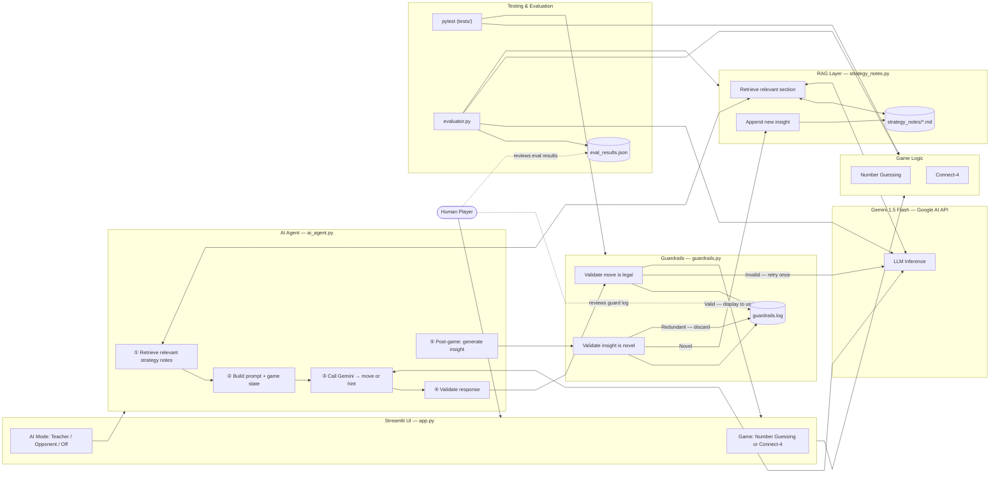

# AI Game Arena — System Diagram

## Component Summary

| Component | File | Role |
|---|---|---|
| Streamlit UI | `app.py` | Entry point; game tabs, AI mode toggle, display |
| Number Guessing Logic | `logic_utils.py` | Parse guesses, check result, score |
| Connect-4 Logic | `connect4_logic.py` | Board, drop piece, win detection |
| AI Agent | `ai_agent.py` | Orchestrates RAG → Gemini → guardrail workflow |
| RAG Layer | `strategy_notes.py` | Load, retrieve, and update persistent strategy notes |
| Strategy Notes | `strategy_notes/*.md` | Accumulated game knowledge (seed + updates) |
| Guardrails | `guardrails.py` | Validate moves and notes updates; log all decisions |
| Gemini API | Google AI | LLM for move decisions, hints, insights, retrieval |
| Evaluator | `evaluator.py` | Reliability: AI-vs-AI, convergence, consistency, integrity |
| Tests | `tests/` | Unit tests for game logic and guardrails |

## Data Flow Summary

1. **Human** selects game and AI mode in the Streamlit UI
2. **Agent** retrieves relevant strategy notes from the RAG layer (which queries Gemini to extract the most relevant section)
3. **Agent** builds a prompt combining the persona, retrieved notes, and current game state, then calls **Gemini**
4. **Gemini** returns a move (Opponent) or hint (Teacher); **Guardrails** validate it before it reaches the user
5. If the move is invalid, the agent retries once then falls back to a random legal move
6. After the game ends, **Gemini** generates an insight; **Guardrails** check it is novel before appending it to the strategy notes
7. **Evaluator** and **pytest** run independently to verify correctness and reliability; human reviews the output files
